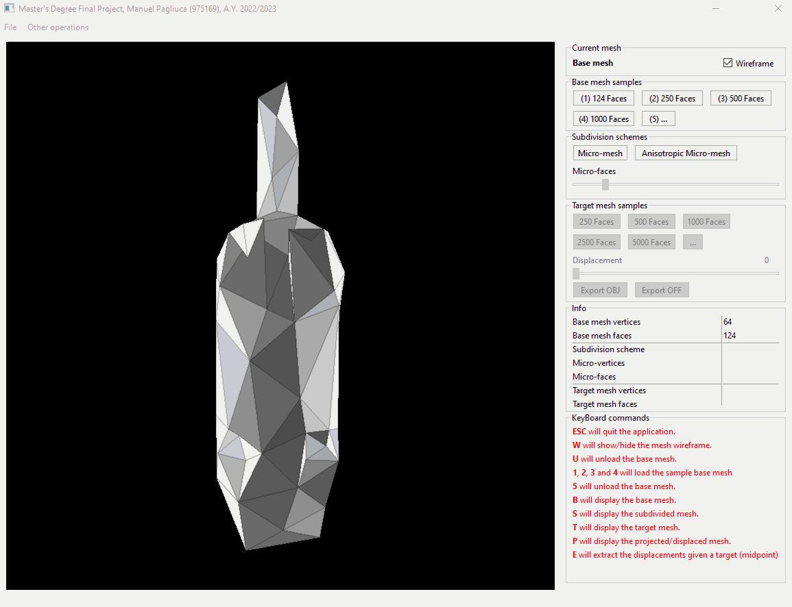
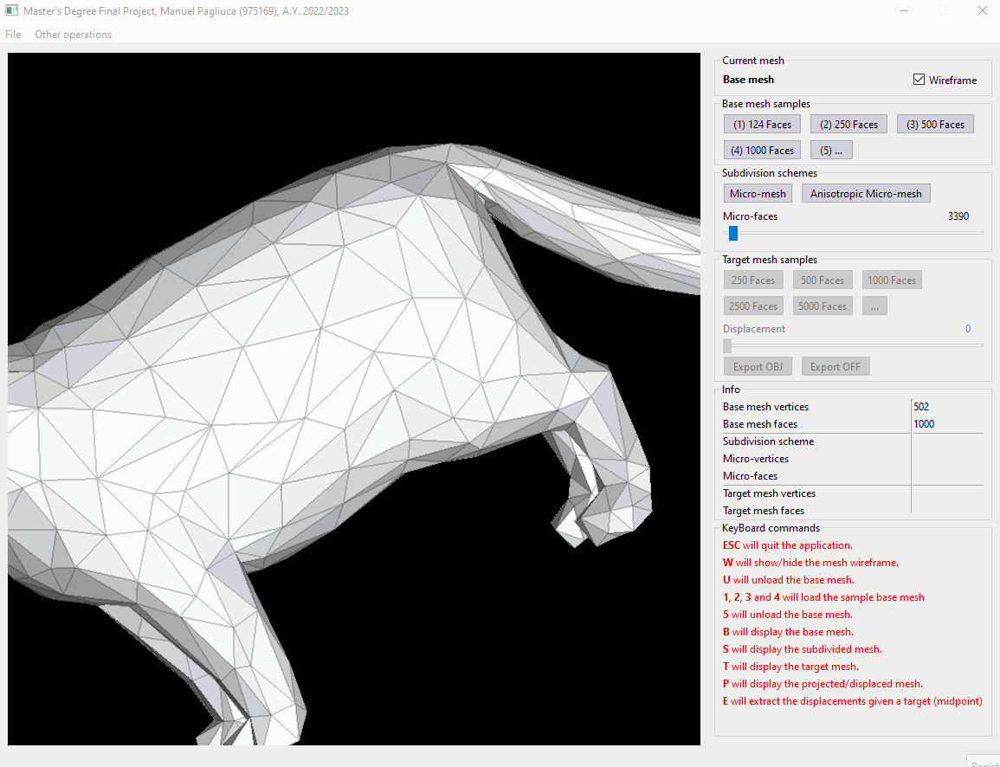
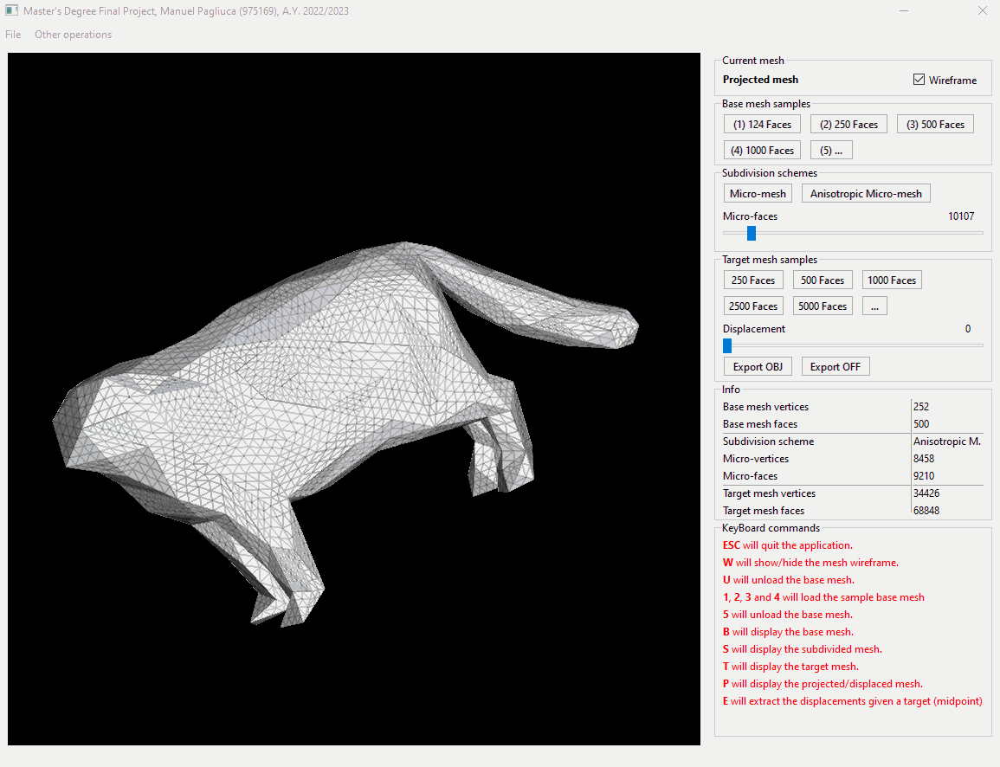

# Adding anisotropy control to the Micro-meshes schema


[](mailto:pagliuca.manuel@gmail.com)


## About the project
Final project for the master's degree in Computer Science A.Y. 2022/2023.

### [Abstract](https://manuelpagliuca.github.io/uploads/Abstract_Master_s_Thesis__en_.pdf)
This [thesis](https://manuelpagliuca.github.io/uploads/MANUEL_PAGLIUCA_ANISOTROPIC_MM_Master_s_Thesis__Integral_.pdf) aims to empirically investigate the imaginable performance for data structures suitable for effectively representing extreme-resolution 3D polygonal surfaces designed for multi-resolution rendering on GPUs.

To this end, supporting algorithms will be designed, implemented, and tested that transform "traditional" (i.e., indexed) high-resolution triangular meshes into the analyzed data structures, and then measure the approximation errors introduced through appropriate geometric measurements.

Other alternative schemes will be studied, which are considered variants of the so-called "micro-meshes" scheme offered by the latest generation of vendor-specific GPU hardware. These data structures are characterized by the use of a semi-regular subdivision of a medium-resolution "base mesh," followed by displacement of the generated vertices. Variants introduced may include the adoption of an anisotropic subdivision step, the adoption of an irregular recursive subdivision scheme, or others.

## Dependencies
* [Qt](https://www.qt.io/)
* [OpenGL Mathematics](https://glm.g-truc.net/0.9.9/index.html)
  * The headers are placed in the directory `Dependencies\GLM`
* [PyMeshLab](https://pymeshlab.readthedocs.io/en/latest/installation.html)

## Sample models
As sample models in this repository I've prepared different version of [Pallas Cat](https://free3d.com/3d-model/pallas-cat-v1--576987.html) by *printable_models*

## Python script (empirical analysis)
Executing this script will generate **n** samples for both the subdivision schemes (current and variant). A table (as a text file) containing the face quality values (according to inradius/circumradius metric) will be built for both batches of samples.

The table will be ordered by a factor **F** used, this will allow the comparison of one sample of a table with a sample of the other table, the factor modulates the intensity of subdivisions.

In the [thesis](https://manuelpagliuca.github.io/uploads/MANUEL_PAGLIUCA_ANISOTROPIC_MM_Master_s_Thesis__Integral_.pdf), the comparison is also described using the face area coefficent of variation

The commands generate two batches of samples, multiple execution of the commands are used for the analysis since multiple models are tested.
```batch
python face-stats.py --base-mesh=base.obj --target-mesh=target.obj
```
Default values if you *omit* some of the options:
* `--base-mesh = pallas_124.obj`
* `--target-mesh = pallas_5000.obj`

## Graphical User Interface

### Sample loading

### Scheme subdivisions

#### Displacement


### CLI commands

#### Generate single subdivided sample
**Exports** the subdivided (not displaced) mesh of the given base mesh.

```cmd
anisotropic-micromesh.exe --base-mesh=base.obj --microfaces=100
```
> In this example the base mesh is being subdivided by the amount of micro-faces passed (`F` can't be passed, since it works in function of the target mesh) using the current scheme ("isotropic" scheme).

#### Generate sample
**Exports** the subdvided and displaced mesh given the inputs

```cmd
anisotropic_micromesh.exe gen-sample --base-mesh=base.obj --target=target.obj --scheme=aniso --factor=3.5
```
> In this example the base mesh will be subdivided using the `anistropic` subdivision scheme, with a factor `F=3.5` (subdividing x3.5 times the faces of the target mesh).